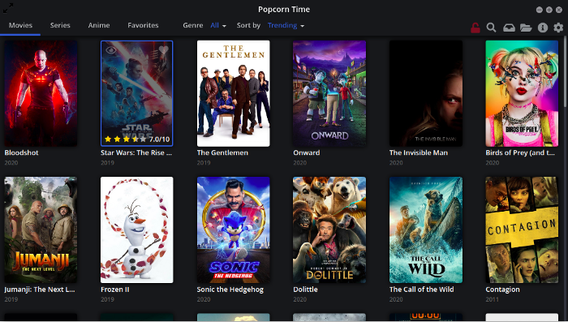

So yesterday my Netflix account expired and I started thinking of alternatives to it. I googled and found out Popcorn-time as a suitable substitute.


##But first what is Popcorn-Time?

[Popcorn Time](https://popcorntime.app/) is an open source [Netflix](https://www.netflix.com/in/) inspired [torrent](https://en.wikipedia.org/wiki/Torrent_file) streaming application for Linux, Mac and Windows. It uses torrent underneath but allows you to start watching the videos (almost) immediately. It’s like you are watching videos on streaming websites like YouTube or Netflix. You don’t have to wait for the download to finish here.

##And why should you give it a try?

We all agree that watching movies online sucks(excuse the lang!). If you want to watch movies online without those creepy ads, Popcorn Time is a good option.


##Disclaimer!!

>    Using torrent to download movies is illegal in several countries where there are strict laws against piracy. In countries like the USA, UK and West European you may even get legal notices. That said, it’s up to you to decide if you want to use it or not. You have been warned.
<br>
>(If you still want to take the risk and use Popcorn Time, you should use a VPN service that has been specifically designed for using Torrents and protecting your identity. Even then it’s not always easy to avoid the snooping authorities.)


##So let’s begin setting this up on your system

>I am using Ubuntu 19.04 here

###Step 0: Install dependencies

To avoid errors like “Popcorn-Time: error while loading shared libraries: libgconf-2.so.4: cannot open shared object file: No such file or directory” you should install some dependencies with this command:

```bash
sudo apt update && sudo apt install libcanberra-gtk-module libgconf-2-4
```

###Step 1: Download Popcorn Time

Download Popcorn Time from its official website. The download link is present on the homepage itself.

[Get Popcorn Time](https://popcorntime.app/)


###Step 2: Install Popcorn Time

Once you have downloaded Popcorn Time, it’s time to use it. The downloaded file is a zipped file that consists of an executable among other files. While you can extract this file anywhere, the Linux convention is to install additional software in /opt directory.

Go to the Downloads directory.

```bash
cd ~/Downloads
``` 

Extract the downloaded Popcorn Time files into the newly created /opt/popcorntime directory.

```bash
sudo cp -r Popcorn-Time-0.4.1-linux64 /opt/
sudo mv Popcorn-Time-0.4.1-linux64/ /opt/popcorntime
``` 


###Step 3: Make Popcorn Time accessible for everyone

You would want every user on your system to be able to run Popcorn Time without sudo access, right? To do that, you need to create a symbolic link to the executable in /usr/bin directory.

```bash
sudo ln -sf /opt/popcorntime/Popcorn-Time /usr/bin/Popcorn-Time 
```


###Step 4: Create desktop launcher for Popcorn Time

So far so good. But you would also like to see Popcorn Time in the application menu, add it to your favorite application list etc.

For that, you need to create a desktop entry.

```bash
sudo nano /usr/share/applications/popcorntime.desktop
```

Insert the following lines here:

```bash
[Desktop Entry]
Version = 1.0
Type = Application
Terminal = false
Name = Popcorn Time
Exec = /usr/bin/Popcorn-Time
Icon = /opt/popcorntime/popcorn.png
Categories = Application;
```

If you used Nano editor, save it using shortcut Ctrl+X. When asked for saving, enter Y and then press enter again to save and exit.

We are almost there. One last thing to do here is to have the correct icon for Popcorn Time. For that, you can download a Popcorn Time icon and save it as popcorn.png in /opt/popcorntime directory.

You can do that using the command below:

```bash
wget -O /opt/popcorntime/popcorn.png https://upload.wikimedia.org/wikipedia/commons/d/df/Pctlogo.png
```

After this being done, search for the Popcorn time, and click on the launcher!


But you are not done yet, get a VPN as well. I am using [Windscribe](https://windscribe.com/) here.


##Steps to use Windscribe for your system are:

>These steps are particularly for Ubuntu 19.04. So if you have any other linux distro, choose from [here!](https://windscribe.com/guides/linux#how-to)


###1. Get a Windscribe Account

[Create a free account](https://windscribe.com/signup) if you don’t have one already.


###2. Add the Windscribe signing key to apt

```bash
sudo apt-key adv --keyserver keyserver.ubuntu.com --recv-key FDC247B7
```


###3. Add the repository to your sources.list

```bash
echo 'deb https://repo.windscribe.com/ubuntu bionic main' | sudo tee /etc/apt/sources.list.d/windscribe-repo.list
```


###4. Run apt-get update

```bash
sudo apt-get update
```


###5. Install windscribe-cli

```bash
sudo apt-get install windscribe-cli
```


###6. Login to Windscribe

Use the login credentials that you just used while signing in!

```bash
windscribe login
```


###7. Connect to Windscribe

```bash
windscribe connect
```


###8. To DisConnect

```bash
windscribe disconnect
```


###Need help?

```bash
windscribe --help
```

So, that is it! no more irritating popups of advertisements. Enjoy your popcorns with Popcorn-Time and your cuddly bear :P(Can’t provide the steps for that though :D)



:wq

<!--<span style="background-color: #70C80F"> -->
<!-- 

```bash

```
 -->